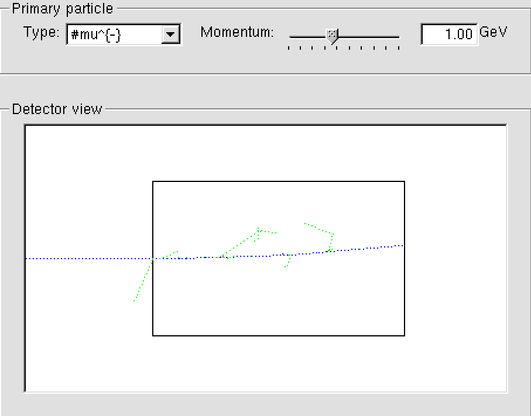
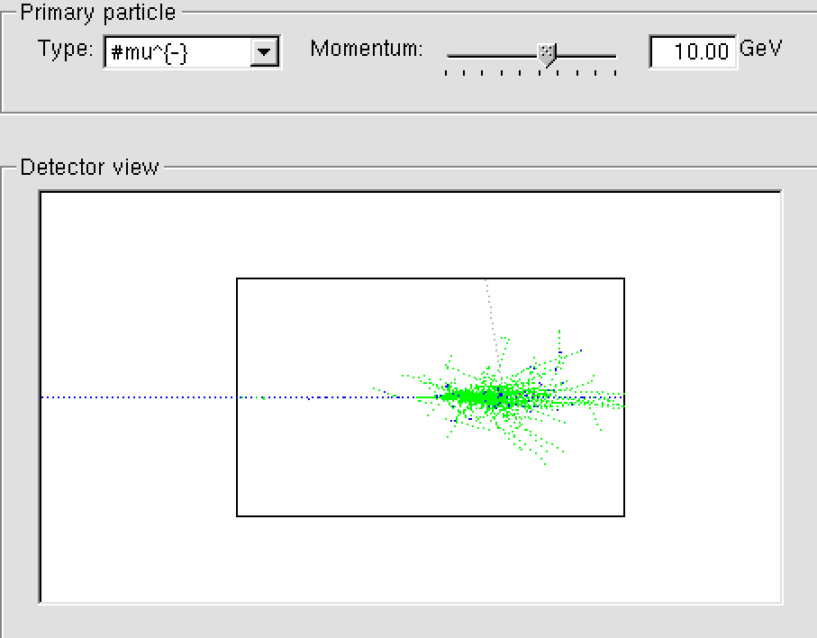
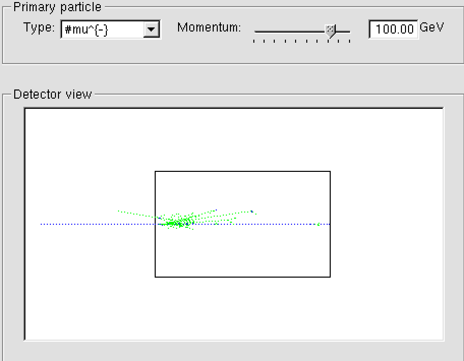
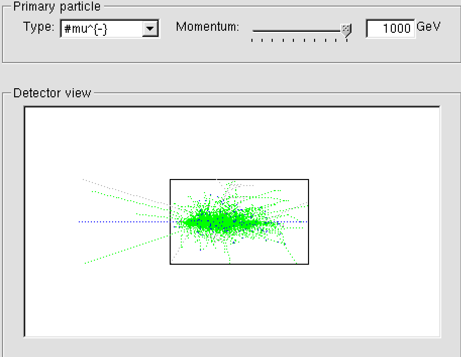
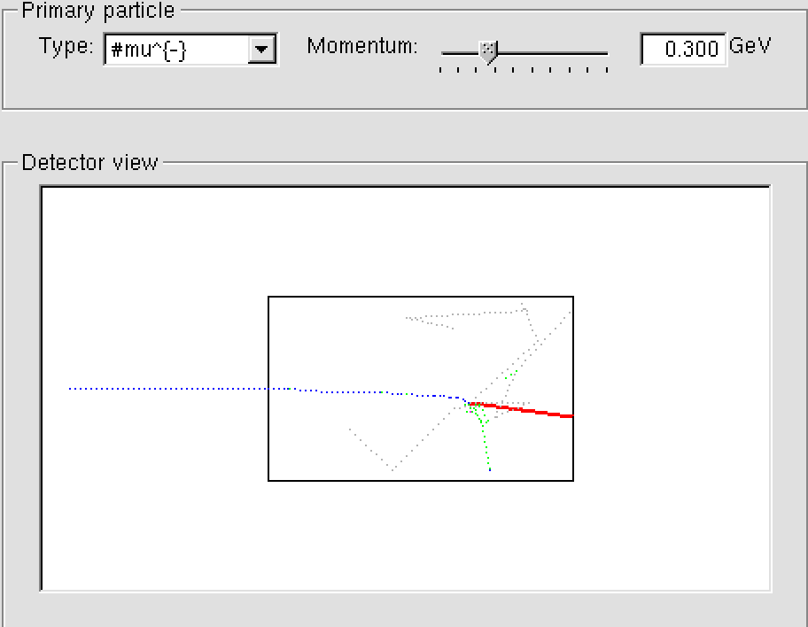
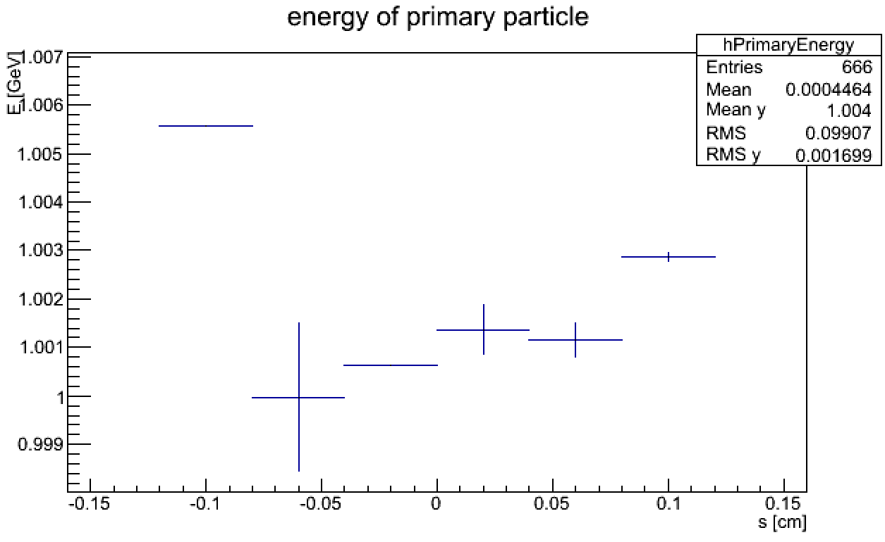
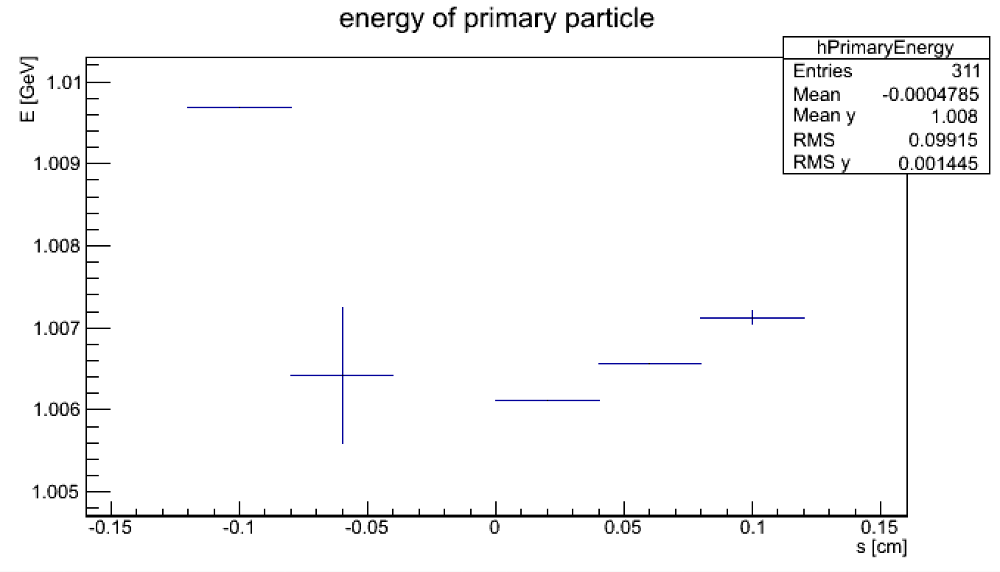
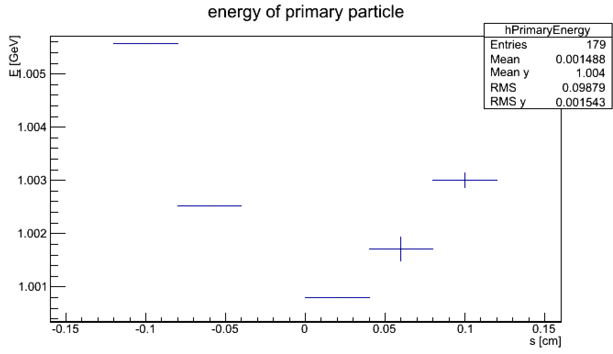
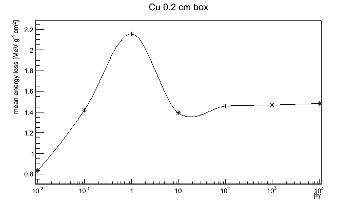
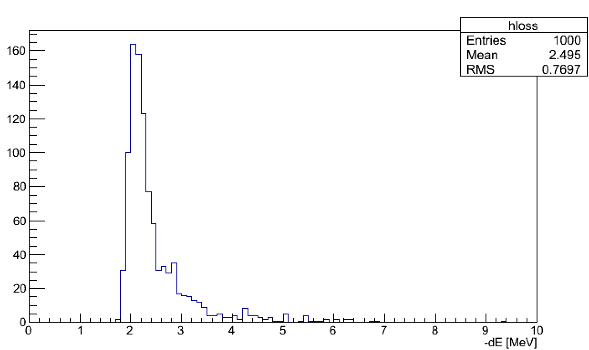

---
title: sheet 5
author: Wu, Chih-Chieh
documentclass: ctexart
numbersections: 3
geometry: margin=2cm
...
<!-- -*- coding: utf-8 -*- -->

# muon shooting into Pb block #

## Higher energies ##
Electromagnetic interaction dominates. Mainly photons and electrons are produced within the 20 cm thick lead block, and scattering processes look alike from 1 GeV to 1000 GeV, with photons and electrons involved. In general, the incident muon is deflected less at higher energies. With a small probability (once in dozens of runs), there are much more secondary particles produced, as shown in the 10 GeV screenshot. I guess this should correspond to the case where the scattered particle by chance obtained a much higher energy, sufficient to give rise to a chain of secondary processes.

## lower energies ##
The incident muon will always decay and would not be able to exit the 20 cm lead. From the panel, we learn that neutron, photon, and muon neutrino are involved. since muon has negative charge, the decay should also be accompanied by a production of electrons for charge conservation. Their large interaction cross section with the lead block and the smaller energy the got from the slower incident muon make themselves not easily found.

<!--  -->
<!--  -->

# simulation with thin material in comparison with Bethe-Bloch #

When a particle is sent into a 0.2 cm thick block, the simulation shows that the energy of the original muon does not monotonically decrease with distance. This is very strange at first glance. However, this result is actually understandable if the thickness of the block is comparable to the propagation step of simulation. My guess is that the simulation decides to take smaller propagation step when the process is more lossy. Hence, the particle energy of the many not-so-lossy processes are not sampled in the middle of the block. In other words, the discrete nature of simulation give rise to this artifact.
For a crude estimation, let's take the statistics at the end of the block for comparison. 

- 1 GeV muon sent into 0.2 cm thick Cu block
    - mean energy at the left end: 1.0056 GeV
    - mean energy at the left end: 1.00286 GeV
    - loss = 2.74 MeV

- 1 GeV pion sent into 0.2 cm thick Cu block
    - mean energy at the left end: 1.009693 GeV
    - mean energy at the left end: 1.007075 GeV
    - loss = 2.618 MeV

- 1 GeV muon sent into 0.2 cm thick Fe block
    - mean energy at the left end: 1.0056 GeV
    - mean energy at the left end: 1.0030 GeV
    - loss = 2.6 MeV

- quick estimation

    - density of copper: 8.96 g/cm3
    - reading of Bethe-Bloch plot for muon: ~ 2 $MeV cm^2/ g$

$$ 2 MeV cm^2/ g \cdot 8.96 g/cm^3 \cdot 0.2 cm = 3.584 MeV $$

Mean simulated energy losses are on the same scale as (but samller than) the mean energy loss Bethe-Bloch would predict, which is qualitatively in agreement with the lecture notes.

# incident momentum dependent energy loss #

The program uses $GeV/c^2$ as the unit for mass; we have 
m = 0.1057 $GeV/c^2$ for a muon. Setting c to 1, 
$$ p = \gamma m v = \left(0.1057 GeV\right) \cdot \beta\gamma $$

In particular, the energy loss distribution of the 1000 runs for $\beta\gamma = 10$ is as follows:

Roughly speaking, the scale $\beta\gamma = 1$ is a special value, represents the division of relativiestic and non-relativistic behavior. Above that, energy loss of a particle traversing a thin film tens to a constant value, as plotted in the lecture note. 
