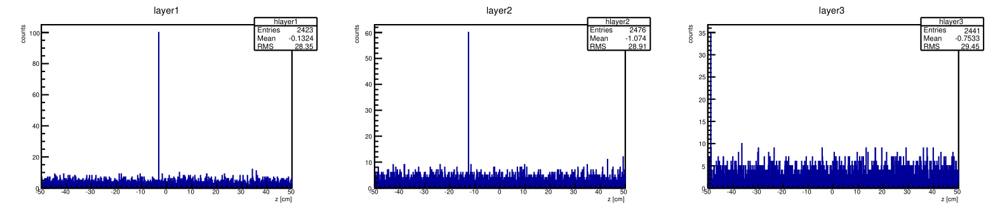
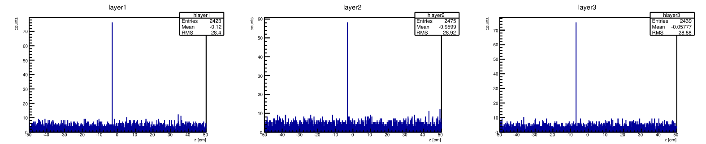

---
title: sheet 6
author: Wu, Chih-Chieh
documentclass: ctexart
numbersections: 3
geometry: margin=2cm
...
<!-- -*- coding: utf-8 -*- -->

# setup #

The trajectory of the particle is bent by a lot at such a strong field. The bending is increasingly pronounced as it propagate to the right, which means that at the 2cd and especially the 3rd layer the particle would traverse through many strips before exiting. 

When the momentum is increased, the particle bends less, making the cluster width narrower.

# hit reconstruction in a strip tracker #

## algorithm for z position of trajectory at a certain layer ##
The current algorithm for extracting the z value is the the position of the strip that gets the most hits. The downside is that the z value becomes discrete: suppose the actual z value falls almost at the middle of 2 strips, so that all the hits concentrate on these 2 strips, and one of the two happen to get a few counts more than the other. With this algorithm, all hits would be *entirely* credited to the strip that wins by a marginal amount. As such, this algorithm can misinterpret the z value by at most half a pixel size (strip width), and is thus not the best we can get out of the data, as shown in the following snaphot:

A better way would be to calculate an average of the strip postions, weighted by the hits those strips get.

## Noise cut ##
The choice of noise cut should depend on the background noise level. In the simulation, gaussian noise of $\sigma=3$ is manually added to give fake counts at all bins. The noise cut then should be at least a few times a large as $\sigma$, but not so large as to be comparable to the real signal. After some trial, it seems that a noise cut of 20 does a good job.
In reality we should inspect the count variance at the detector regions where there definitely are no real signal, in order to decide the noise cut.

# fitting with a circular track #

Momentum is extracted from the fit radius, with 
$$ p_T [GeV/c] = 0.3 \cdot B [T] \cdot r [m] $$
$$ \Longrightarrow \sigma_{p_T} = 0.3 \cdot B [T] \cdot \sigma_{r} $$

Fitting the $p_T$ histogram gives 

$\mu_{p_T} = 5.0105$ <!--err = 1.04749e-03 -->

$\sigma_{p_T} = 2.1710\times 10^{-2}$ <!--err = 8.16567e-04 -->

Fitting the pull distribution $\frac{p_T - p_{true}}{\sigma_{p_T}}$ gives

$\mu_{p_T} = 0.562$ <!--err = 1.01145e-01 -->

$\sigma_{p_T} = 1.63$ <!--err = 1.07594e-01 -->

Notice that the pull distribution deviates a little from 5 GeV, the input particle energy we set. The reason is not clear to me. Even if some energy from the particle is deposited on the 1st and 2cd strips, which reduces the momentum (yet by design should be a significant portion of the total momentum), the value would have been *underestimated* instead of overestimated.

Setting a more precise value of c, i.e. using $$ p_T [GeV/c] = 0.29979 \cdot B [T] \cdot r [m] $$, the result is less biased by a little bit, but the issue still exists.

$\mu_{p_T} = 5.00695$ <!--1.04321e-03 -->

$\sigma_{p_T} = 2.15567 \times 10^{-2}$ <!--err = 7.89131e-04 -->

Fitting the pull distribution $\frac{p_T - p_{true}}{\sigma_{p_T}}$ gives

$\mu_{p_T} = 0.4209$ <!--err = 9.14515e-02 -->

$\sigma_{p_T} = 1.56$ <!--err = 9.67335e-02 -->

# different track parametrization #

With the previous parametrization, fitting is sensitive to the initial value in the sense that z0 (i.e., z position of the center of the circular trajectory) changes sign. The same initial value z0 that work for a trajectory of a particle with positive charge would however be complete off for a particle with negative charge. Hence one may have to change the initial value of optimization for different charges, which is not so elegant. The goal of the different parametrization is to resolve this issue.

Now the trajectory fitting does indeed work without needing to change the initial value according to sign. Setting the initial value for curvature C to 0 work for  both positive and negative charges.

Error propagation has to be done accordingly. Now momentum is extracted from the fit radius with 
$$ p [GeV/c] = 0.3 \cdot B [T] \cdot \frac{1}{C} [m] $$
where $C$ is the curvature of the trajectory.
$$ \Longrightarrow \sigma_{p_T} = 0.3 \cdot B [T] \cdot \sigma_{r} = 0.3 \cdot B [T] \cdot \frac{\sigma_{C}}{C^2} $$

Note: actually the plots in previous sections of this report are already done with this parametrization.

# momentum resolution #

## position of the middle tracker ##
Intuitively, the middle layer should be put at around the center position of the 1st and 3rd layers. If it is placed too close to the 1st (3rd) layer, the information of z position would be similar to what 1st (3rd) layer would found, which doesn't help us gain much information. This intuition could be formulated rigorously is valid, in that the distribution of $p_T$ has the smallest width when the 2cd layer lies around the center, within a range of 5 to 10 cm. The fact that there is not a definite pos2 that gives the minimal probably have something to do with the discrete nature of the fitted trajectory radii: some 2cd layer x position might just happen to be such that the error in z position is smaller.

Fixing momentum p = 5 [GeV/c], B = 3 [T], pos1 = -45 [cm], pos3 = 45 [cm], supporting structure length = 0.01 [cm], simulation gives

| pos2(cm) | $\sigma_{pT}$ (GeV/c)  | 
|----------|:---------------------:|
|   -30    | $3.375\times 10^{-2}$ |
|   -15    | $2.419\times 10^{-2}$ |
|    -5    | $2.267\times 10^{-2}$ |
|     0    | $2.150\times 10^{-2}$ |
|     5    | $2.300\times 10^{-2}$ |
|    15    | $2.441\times 10^{-2}$ |
|    30    | $3.162\times 10^{-2}$ |

## resolution of transverse momentum ##

Fixing B = 3 [T], pos1 = -45 [cm], pos1 = 0 [cm], pos3 = 45 [cm], supporting structure length = 0.01 [cm], simulation gives

|p (GeV/c)| $\sigma_{pT}$ (GeV/c)  |relative error (%)|
|---------|:----------------------:|:----------------:|
|    1    | $3.263 \times 10^{-3}$ | 0.3263 |
|    10   | $7.532 \times 10^{-2}$ | 0.7532 |
|    25   | $9.541 \times 10^{-1}$ | 3.8164 |
|    50   |         --             | --     |

The discrete $p_T$ result stems from the problem with the oversimplied hit position finding algorithm mentioned previously. Higher input momentum means a much larger trajectory radius, and one strip spacing's difference could change the fit radius result by a lot, thus not surpringly particles with higher momenta are more prone to such artefact.

## magnetic field ##

Simulation of muon, fixing momentum p = 5 [GeV/c], pos1 = -45 [cm], pos1 = 0 [cm], pos3 = 45 [cm], supporting structure length = 0.01 [cm], simulation gives

|B (T)| $\sigma_{pT}$ (GeV/c)   |
|-----|:-----------------------:|
| 1   | $6.08754\times 10^{-2}$ |
| 2   | $2.90233\times 10^{-2}$ |
| 3   | $2.19244\times 10^{-2}$ |
| 4   | $1.65534\times 10^{-2}$ |
| 5   | $1.46002\times 10^{-2}$ |
| 6   | $1.25402\times 10^{-2}$ |

The stronger the magnetic field, the more the particle is bent, the more information the tracker gets, hence the better the resolution. The resolution scales with $1/B$.

<!-- pull sigma: 1.87361e+00   1.32015e-01 -->

fitted with 
$$ \sigma_{p_T} = \frac{a_0}{B} + a_1 $$
$$a_0 = (57.724 \pm 1.808)\times 10^{-3}$$
$$a_1 = (2.349 \pm 0.901)\times 10^{-3}$$

## total length ##

Simulation of muon, fixing momentum p = 5 [GeV/c], B = 6 [T], 2cd layer at the center of the 1st and the 3rd later, supporting structure length = 0.01 [cm], simulation gives

|total length (cm)| $\sigma_{pT}$ (GeV/c)|
|---------|:-----------------------:|
| 90*0.25 | $1.32130\times 10^{-1}$ |
| 90*0.33 | $6.82852\times 10^{-2}$ |
| 90*0.50 | $3.28601\times 10^{-2}$ | 
| 90*0.75 | $1.75582\times 10^{-2}$ |
| 90*1.00 | $1.29062\times 10^{-2}$ |

$$ \sigma_{p_T} = \frac{a_0}{L^2} + a_1 $$
$$a_0 = 63.29 \pm 1.91$$
$$a_1 = (3.66 \pm 1.69)\times 10^{-3} $$

The longer the tracker size, the more bending it can see, so the better the performance. In particular, resolution does scale with $1/L^2$.
